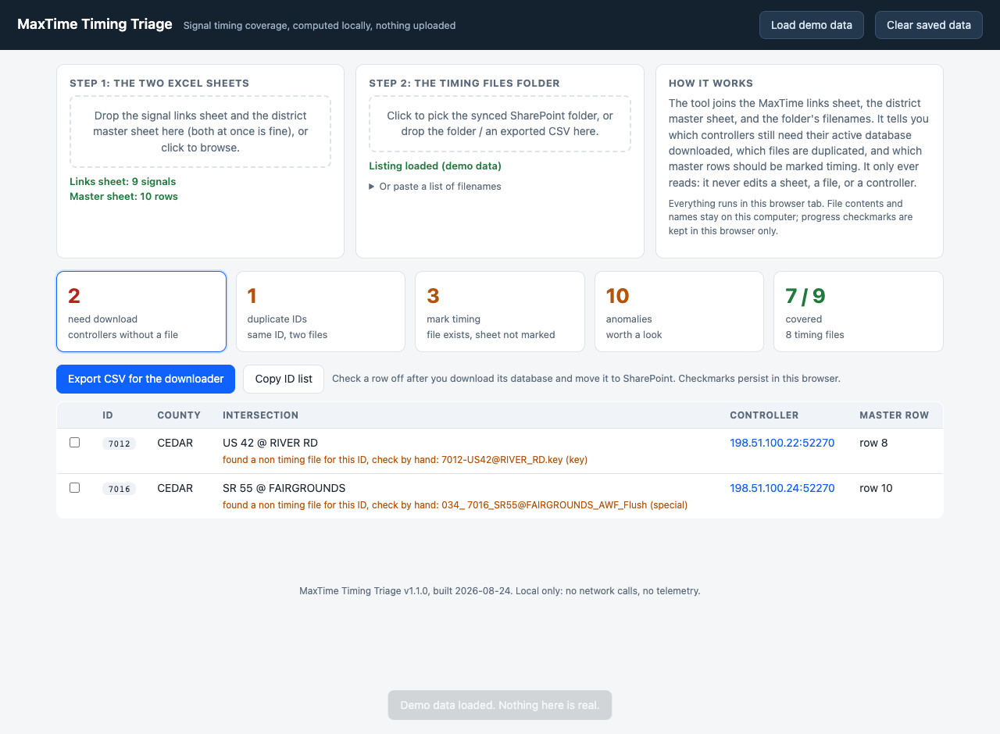
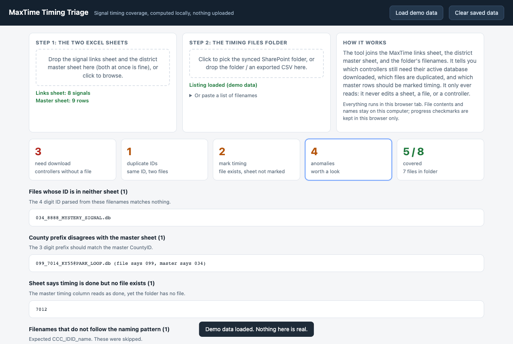

# MaxTime Timing Triage

A local, zero install toolkit that turns a slow manual audit of traffic signal
timing databases into a five second cross reference, built for a district
traffic signal operations team.

## The problem

Each traffic signal runs a Q-Free MAXTIME controller whose active timing
database must be backed up to a shared SharePoint folder. Keeping that folder
complete meant manually cross referencing three sources: an Excel sheet of
controller links, a master sheet whose status column is free
text ("yes", "timing 2025", "timing yes- key not yet", a bare date), and the
folder itself, hundreds of files whose names encode a county code and signal
ID. Finding what was missing, spotting duplicate files, and updating the
status column was all done by eye.

## What this does

**`webapp/index.html`** is the whole tool: one self contained HTML file with
no dependencies, no build step, and no network access. Drop in the two Excel
sheets and the folder listing (a synced folder, a SharePoint CSV export, or a
pasted list) and it computes the results below.

Files are matched to signals by the 4 digit signal ID alone, not by a rigid
name pattern, because the folder is filled by hand and the names are
inconsistent: some use a dash instead of an underscore, some carry a stray
space, some drop the county code, some are key files or subsystem exports
rather than timing databases. Matching on the ID recovers those while a
separate list flags the ones whose names should be standardized.

- **Needs download**: every MaxTime signal without a timing file, each with a
  clickable link straight to its controller, a persistent checkbox for
  tracking progress, and a CSV export.
- **Duplicates**: signal IDs claimed by more than one file, with paste ready
  note text for the sheet.
- **Mark timing**: signals whose file exists but whose master sheet row does
  not say so yet, with the exact row number to update.
- **Box check**: signals whose detection box is not yet confirmed in the master
  sheet and that are not front rack, each with a direct link to the controller
  at port 57150 where the box is confirmed. The detection type is shown so
  loops (usually no box) are easy to tell from radar.
- **Anomalies**: nonstandard file names worth retitling, county prefixes that
  contradict the master sheet, subsystem files (ICWS, AWF) that are not timing
  databases, files matching no known signal, signals linked but missing from
  the master sheet (with their intersection, to check before adding a row),
  duplicate rows inside the master sheet, and rows claiming a timing file that
  does not exist (with any non timing file that shares the ID, so a misnamed
  file is easy to spot).
- **Out of jurisdiction**: signal IDs below 4000 are Fayette County, which the
  district does not maintain. Those master rows are set aside before every
  cross reference above, so nothing suggests work on them and their timing
  column goes back to the sheet untouched. The anomalies tab shows the count
  and the county breakdown, and nothing else.

The **Load demo data** button fills the page with a small synthetic dataset
(fake counties, RFC 5737 documentation IP addresses) so the tool can be
demonstrated without any real data. Both screenshots above show that demo set.

**`webapp/box.html`** is the second job, on its own page: the clickbox
configuration column. It takes the same two sheets plus a listing of the
SharePoint clickbox configuration folder and works out which signals still
need the controller opened, which already have a file and only need the sheet
labelled, and what to paste back into the Detection, Box or Front rack, and
Box Verified columns. SharePoint is the source of truth: a row claiming the
box was saved with no file behind it is work, not a finish. Exports carry the
date and time they were made, so one signal appears under several names and
matching is by the four digit ID alone; a separate tab flags exports whose
name carries the ID but not the intersection.

**`downloader/probe_iomodules.py`** tests, against one controller, whether the
cabinet IO module configuration can be read over the same open API the
downloader uses. The manual check is `Controller`, `Advanced IO`,
`Cabinet Configuration`, `IO Modules`, looking for a `TS2 DR1 BIU` in module
2; if that answer can be read directly, hundreds of controller visits collapse
into one script run. It discovers MIB names from the controller's own web UI
rather than guessing, and issues GET requests only.

**`downloader/fetch_missing.py`** automates the per controller download
itself: it reads the dashboard's CSV export and, for each signal, asks the
controller for its active database name and streams that database to disk,
sequentially, throttled, resumable, and strictly read only. It needs no
login (the controller API is open on the local network) and refuses to save
a file whose ID does not match the row it came from. Copying results into
SharePoint stays a deliberate manual step. The two endpoints it uses are
documented in `downloader/PROTOCOL.md`; an offline test
(`downloader/test_downloader.py`) drives the client against a mock
controller that replays them.

## The workflow it supports

1. Load the two sheets and the folder listing.
2. Mark timing for the signals in that list, in the master sheet.
3. Download the missing databases (the CSV export feeds
   `downloader/fetch_missing.py`), confirm each is the intended one, and place
   it in SharePoint.
4. Work the box column in `webapp/box.html`: check IO module 2 for a
   TS2 DR1 BIU, fetch the clickbox configuration at port 57150, and paste the
   three columns back.
5. Resolve the anomalies by hand: retitle nonstandard files, reconcile
   duplicate master rows, and fill in missing IDs.
6. Rename the master sheet's box column from "Box Verified" to
   "Box Configuration Downloaded"; the tool reads either name.

## Privacy by design

The data involved (internal controller addresses, infrastructure records) is
sensitive, so the design guarantees it never leaves the machine:

- The dashboard is a single static file opened from disk. It makes **zero
  network requests**; the automated test suite fails if it ever makes one.
- Spreadsheets are parsed **in the browser** with a small built in xlsx
  reader (raw zip parsing plus `DecompressionStream`); nothing is uploaded.
- Only **filenames** are read from the timing folder, never file contents.
- Progress checkmarks and loaded data live in the browser's local storage on
  that computer only, and one button wipes them.
- This repository contains **no real data**: the `.gitignore` blocks every
  spreadsheet, database, listing, and capture file, and the demo dataset is
  synthetic.
- The downloader prompts for credentials at runtime and never writes or logs
  them.

## Parity testing

The box page keeps its own rules in one marked block with no DOM in it, and
`tools/verify_box.py` pulls that block out of the HTML and runs it under node
against the sheets plus a mock clickbox folder built to trip every file rule,
so the counts can be checked without opening a browser.

The cross referencing rules exist twice: a Python reference implementation
(`tools/triage_lib.py`) and the JavaScript port inside the dashboard.
`tools/verify.py` runs the reference against the real sheets plus a mock
folder listing designed to trip every rule, and a Playwright script then
loads the dashboard with the same inputs and asserts both implementations
produce byte identical results, along with checkbox persistence, CSV export,
demo mode, and the zero network guarantee.

## Deploying to a work computer

Email or copy `webapp/index.html` and `webapp/box.html` to the machine and open
them in Edge. That is the entire install. The footer shows a build stamp so it is always clear
which version is in use. The downloader needs only a standard Python 3
install: `python3 fetch_missing.py needs_download.csv`.

## Repository layout

    webapp/index.html          the timing triage dashboard, self contained
    webapp/box.html            the clickbox configuration page, self contained
    downloader/fetch_missing.py  controller downloader
    downloader/probe_iomodules.py  read only IO module probe, one controller
    downloader/test_downloader.py  offline test against a mock controller
    downloader/check_biu.py    reads the IO module table, many controllers
    downloader/fetch_clickbox.py  reports what a clickbox Properties screen holds
    downloader/PROTOCOL.md     the two controller endpoints it uses
    downloader/BIU_CHECK.md    work computer instructions for the BIU checker
    downloader/CLICKBOX.md     work computer instructions for the clickbox tool
    tools/triage_lib.py        reference parsing and cross referencing logic
    tools/verify.py            builds mock listing and expected results
    tools/verify_box.py        runs box.html's own rules under node
    docs/                      screenshots (synthetic demo data only)
    data/                      local working files, ignored by git

No real data can enter this repository: the demo dataset is synthetic and the
`.gitignore` blocks everything else. The screenshots, the demo button, and the
tests are the only data it will ever contain.

## Automating the repetitive BIU visits

[`downloader/check_biu.py`](downloader/check_biu.py) uses Python + Playwright
with a visible Edge window to sign in and read the IO module table. Calibrate
the table once on the work computer, then test one controller (the default)
before a batch. The updated box page exports unresolved work and previews
results before applying them; unknown checks and existing answers are preserved.
Box configuration downloads remain manual. See the
[work computer instructions](downloader/BIU_CHECK.md) for installation,
calibration, validation and import. Real-controller navigation still needs the
first work-network test; offline tests cover synthetic controller screens.

## The clickbox properties, at port 57150

Before a clickbox configuration can be exported, the device's Name, Location
and Description have to be filled in. Two of the three are already in the
sheets:
Name is the county code and ID from the master sheet (`076-4380`), Location is
the intersection as the links sheet spells it (`US 25 at KY 52 (IRVING RD)`),
and Description is `KYTC D7` on every device. The box page shows all three on
the row with a copy button each, and exports them as `clickbox_worklist.csv`.

A row answered BIU, box carries two ticks rather than one: exported off the
device, and moved to SharePoint. Only the second writes YES into the sheet's
Box Verified column. Importing a run of the script ticks the first, and carries
across whatever the device overwrote as the row's note.

[`downloader/fetch_clickbox.py`](downloader/fetch_clickbox.py) fills those
three fields and exports the configuration, one device at a time and only after
you answer `y` for that signal. A field already holding something different is
called out and needs its own `y`, and what it replaced is recorded. Nothing
else on that screen is touched, and a device that does not show the value back
after saving is reported rather than exported. Configurations land in one
folder of their own, named by the device, with the record of each run kept in a
sibling folder so the first can be dragged into SharePoint whole. `--describe`
opens a device and reports its screen without changing anything, which is how
the rest was written. See [CLICKBOX.md](downloader/CLICKBOX.md).
